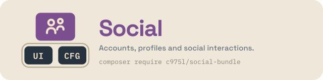

# SocialBundle

Symfony bundle for the social side of a c975L site — social links managed in one single place and share buttons for 15 networks, placed anywhere as blocks. Replaces the former ShareButtonsBundle.

[](https://github.com/975L/SocialBundle/blob/master/LICENSE)
[](https://packagist.org/packages/c975l/social-bundle)
[](https://packagist.org/packages/c975l/social-bundle)
[](https://app.codacy.com/gh/975L/SocialBundle/dashboard)

## Why SocialBundle



Add SocialBundle on top of the shared [UiBundle](https://github.com/975L/UiBundle) + [ConfigBundle](https://github.com/975L/ConfigBundle) foundation to get social links and sharing — no dependency on SiteBundle, ShopBundle or any other satellite bundle, so it drops into any c975L site that needs one. Its `social_links` block reuses UiBundle's generic `Block` entity rather than a dedicated table, following the "singleton CRUD" pattern shared across the ecosystem.

See it in action at [bundles.975l.com/pages/social-bundle](https://bundles.975l.com/pages/social-bundle), and browse every block kind live in the [block gallery](https://bundles.975l.com/pages/blocks).

---

> **TL;DR** — Social links and share buttons for a c975L site. The links are stored as a `social_links` block reusing UiBundle's generic `Block` entity rather than a dedicated table (the "singleton CRUD" pattern), displayed anywhere through a `social_links_display` block or site-wide. Replaces the former ShareButtonsBundle.

## Contents

- **Setup** — [requirements](#requirements) · [installation](#installation) · [assets](#install-assets)
- **Using it** — [social links block](#social-links-block) · [admin management](#admin-management) · [rendering](#rendering-the-block) · [styling](#styling) · [share buttons](#share-buttons) · [site-wide auto-display](#site-wide-auto-display) · [admin help procedures](#admin-help-procedures) · [guided projects](#guided-projects)

## Features

- **Social links block**: a `ui.block` kind (`social_links`) storing an ordered list of links (network + url), plus a site-wide icon style (flat/monochrome, colored badge, ring, or text only) and label visibility - no dedicated entity/table
- **Admin CRUD** for the social links block via EasyAdmin, outside of any page's block collection
- **Rendering component** to display the block wherever it lives, page-attached or not
- **Pickable pointer block** (`social_links_display`) to drop the same site-wide links into any page's block flow, with no data re-entry
- **Share buttons**: a `share_buttons()` Twig function to let visitors share the current (or a given) page on 20 social networks, with an independently picked button shape and fill
- **Share buttons dashboard settings**: pick which networks, and which button shape and fill, are used site-wide, plus an `enable-share-buttons` config key to auto-display them on every page with no template change
- **Pickable pointer block** (`share_buttons_display`) to drop those same site-wide share buttons into any page's block flow, with no data re-entry
- **Icon picker** reusing [c975L/UiBundle](https://github.com/975L/UiBundle)'s searchable `IconPickerType`
- **Stylesheet auto-registration** via UiBundle's `BundleStylesheetProviderInterface` — no manual `<link>` needed
- **Script auto-registration** via UiBundle's `BundleScriptProviderInterface` — no manual `<script>` needed
- **Admin menu entry** registered automatically via `MenuProviderInterface`
- **Admin help procedures** contributed automatically via `ProcedureProviderInterface`
- **Guided projects** contributed automatically via `GuidedProjectProviderInterface` — see [Guided projects](#guided-projects)

---

## Requirements

- PHP >= 8.4
- Symfony 8
- [c975L/CoreBundle](https://github.com/975L/CoreBundle), the single package shipping ConfigBundle and UiBundle
- EasyAdmin

---

## Installation

### Download

```bash
composer require c975l/social-bundle
```

### Install assets

```bash
php bin/console assets:install --symlink
```

This exposes the bundle's compiled stylesheet at `public/bundles/c975lsocial/css/styles.min.css`.

No routes to enable: this bundle only contributes EasyAdmin dashboard entries (auto-registered, see [Admin management](#admin-management)), a Twig component and Twig functions — nothing front-end-routed of its own. Its single configuration key (`social-enable-share-buttons`, see [Site-wide auto-display](#site-wide-auto-display)) is auto-loaded like any other c975L bundle's, via `php bin/console c975l:config:load-all`.

Share buttons' popup behavior needs its Stimulus controller loaded: as long as your layout renders `{{ importmap(['app']|merge(bundle_scripts())) }}` (see [c975L/UiBundle](https://github.com/975L/UiBundle)'s `bundle_scripts()`), it gets auto-registered — no `assets/bootstrap.js` edit needed.

Symfony's AssetMapper still requires the entrypoint to be declared in your app's `importmap.php` though, since `bundle_scripts()` only feeds names to the `importmap()` Twig function, it doesn't create importmap entries itself:

**Add one entry to `importmap.php`** (one-time, at installation):

```php
'@c975l/social-bundle/controllers.js' => [
  'path' => './vendor/c975l/social-bundle/assets/controllers.js',
  'entrypoint' => true,
],
```

---

## Usage

### Social links block

Registers a `social_links` `ui.block` kind (see [c975L/UiBundle](https://github.com/975L/UiBundle)'s Block system) with a dedicated form (`c975L\SocialBundle\Form\Block\SocialLinksType`) and template (`templates/blocks/SocialLinks.html.twig`). Each link is a `network` (picked from every icon found under `public/icons/` and `public/bundles/*/icons/`) and a `url`; label and icon are derived from the network at render time, not stored. Pick **"Autre"** to fall back to a free-text label and UiBundle's `IconPickerType` for a network with no icon of its own.

Three settings apply to the whole block:

- **Introduction text** (`intro`) - an optional rich-text lead-in (UiBundle's `TrixEditorType`, the ecosystem's editor) rendered centered above the icon row (`.social-links-intro`). Left empty, nothing at all is rendered — no wrapper, no blank space.
- **Icon style** (`iconStyle`) - `minimal` (the flat, monochrome glyph, inheriting the surrounding text color), `colored` ("Version colorée": the same glyph turned white on a solid, brand-colored pill background), `outline` (a lighter brand-colored ring on a transparent background, filling in on hover) or `text` ("Texte seul": no glyph at all, the network's name standing as the link - for a footer row set as words, where a row of marks would compete with the site's own). The first three are CSS only (see [Styling](#styling) below), no separate icon asset - same glyph in every case; `text` prints no icon in the markup at all, and prints the label whatever **Display label** below says, an entry showing neither having nothing left to click.
- **Display label** (`displayLabel`) - whether the network name is shown as text next to the icon (still used as `aria-label` regardless).

Unlike most block kinds, `social_links` is tagged `pickable: false` and therefore absent from a page's own block picker: it's a singleton, meant to be edited once and rendered wherever needed (see [Rendering the block](#rendering-the-block)) rather than re-created with duplicate data on every page that wants it.

To insert those same links at a specific spot in a page's block flow (not just the fixed `<twig:c975LSocial:SocialLinks/>` component placement), pick the **`social_links_display`** kind from the page's block picker instead. It's a thin pointer: its own form has no fields and its template just renders `<twig:c975LSocial:SocialLinks/>` internally, so it always reflects the current site-wide links, edited only from [Admin management](#admin-management) — no separate data, no duplication, no extra table.

#### Icons

Ships `public/icons/` with flat, single-color 64×64 SVG glyphs (Font Awesome Free 6.5.1 brand icons, default black fill, no explicit `fill` set) for 37 social/media networks (Instagram, X, YouTube, TikTok, Discord, Threads, Mastodon, GitHub, Twitch, Spotify, SoundCloud, Flickr, Medium, WeChat, Line, Behance, Dribbble, VK, Xing, Messenger, Snapchat, Telegram, Vimeo, plus the ones already covered by UiBundle — see below). Only Font Awesome glyphs are kept here on purpose - no separate, pre-colored "official logo" badge asset: the `colored` icon style above is achieved entirely in CSS (inverting the glyph to white over a solid brand-colored background, see [Styling](#styling)), so every icon only needs to exist once.

`facebook`, `linkedin`, `pinterest`, `whatsapp`, `reddit`, `skype` and `tumblr` deliberately have no `{network}.svg` here: c975L/UiBundle already ships one (used by `share_buttons()` below), and `IconServiceInterface::getIcons()` merges every bundle's `icons/` by filename — a same-named file here would just be silently shadowed by UiBundle's, since `c975lui` sorts after `c975lsocial`.

Icon glyphs are derived from [Font Awesome Free](https://fontawesome.com/) (CC BY 4.0) — keep attribution if you redistribute this bundle's icons on their own.

### Admin management

Because a `Block` can normally only be created by attaching it to a Page (there's no page-independent block library in UiBundle), `SocialLinksCrudController` gives it its own small dashboard entry, scoped to `kind = social_links` — so it can be created/edited without needing a host page. The menu entry ("Réseaux sociaux") is registered automatically through `MenuProvider`, under the "Management" section. Access is controlled by the `site-role-editor` key in ConfigBundle.

The edit form shows a preview of the rendered links below the list. The introduction text and the links themselves are static (reflects the last saved state, not unsaved edits to the form above), but "icon style" and "display label" update it live (see `assets/js/social-links-preview.js`) as you change them.

### Rendering the block

```twig
<twig:c975LSocial:SocialLinks/>
```

Under the hood, this looks up the first `social_links` block via `BlockRepository::findOneByKind()` (also exposed as the `social_link_block()` Twig function) and reuses UiBundle's `render_block()`. Renders nothing if no `social_links` block exists yet. Drop it in your footer, navbar, or anywhere else in your layout — it's not tied to any specific location.

### Styling

The whole block is wrapped in a `.social-links-block` (a `<div>`, not a `<section>`: it carries no heading of its own, and a headingless `<section>` is invalid HTML — the same fallback UiBundle's own block components use). That wrapper owns the vertical step above the block, `--section-space-tight` (UiBundle's page rhythm, so the links are parted from the block above them exactly like any two page sections are), on the top edge only — and none of it inside a `footer`, where the band already sets its own room.

Ships `.social-links` / `.social-link` styles (centered flex row of icon links, wrapping to a second line rather than being clipped on a narrow screen), a `.social-links-intro` one (the optional introduction text, centered above the row) plus a `footer .social-links` variant tightening the gap and setting the band's own vertical room when used in a page footer. Loaded automatically via the `ui.stylesheet` tag — override the classes in your own SCSS if you need a different look.

The list also carries a `.social-links--minimal` / `.social-links--colored` / `.social-links--outline` / `.social-links--text` modifier class (from the block's icon style setting, see [Social links block](#social-links-block)) and each `<li>` a `.social-link--{network}` one — hooks to target from your own SCSS rather than opinions this bundle imposes, except for two, both driven by `sass/_social-brand-colors.scss` (shared with `share_buttons()`'s own per-network colors below): under `.social-links--colored`, each `.social-link--{network}` gets a solid, brand-colored badge - background + white icon (same $white-icon-filter trick as `share_buttons()`) + black-or-white text, whichever reads on that background; under `.social-links--outline`, a brand-colored ring on a transparent background instead, filling in (and turning the icon white) on hover. "Autre" entries keep the default, unstyled look in both cases (no brand color to badge them with). Under `.social-links--text` the pill goes with the glyph - no background, no padding, no radius, underlined on hover - so the row follows the color and font of whatever it is placed in, a footer among the site's other text links being what it is meant for. Kept deliberately smaller (32px) and visually distinct from `share_buttons()`'s own badges (50-65px, see below) so the two icon rows don't compete for attention on the same page.

### Share buttons

Migrated from the now-abandoned [c975L/ShareButtonsBundle](https://github.com/975L/ShareButtonsBundle). Renders one link per network, each pointing directly at that network's share URL (built server-side from the shared page's URL) — no internal redirect route involved.

```twig
{# Full signature #}
{{ share_buttons(networks, shape, fill, alignment, displayIcon, displayText, url, id, displayIntro) }}

{# Display the main networks at the default shape and fill #}
{{ share_buttons() }}

{# Custom selection, ellipse-shaped, centered, icon only #}
{{ share_buttons(['facebook', 'linkedin', 'email'], 'ellipse') }}

{# Round buttons, brand-colored ring instead of a solid fill #}
{{ share_buttons('main', 'circle', 'outline') }}

{# Override the shared URL (defaults to the current page) #}
{{ share_buttons('main', 'wide', 'solid', 'center', true, false, 'https://example.com/my-page') }}
```

| Parameter | Type | Default | Description |
| --- | --- | --- | --- |
| `networks` | `string[]\|'main'` | `'main'` | Network keys, or `'main'` for the default set (`facebook`, `bluesky`, `linkedin`, `pinterest`, `email`) |
| `shape` | `string` | `'wide'` | `wide`, `ellipse`, `square`, `rounded`, or `circle` |
| `fill` | `string` | `'solid'` | `solid`, `transparent`, `outline`, or `minimal` |
| `alignment` | `string` | `'center'` | `left`, `center`, or `right` |
| `displayIcon` | `bool` | `true` | Show the network icon |
| `displayText` | `bool` | `false` | Show the network name |
| `url` | `string\|null` | `null` | URL to share, defaults to the current page |
| `id` | `string\|null` | `null` | HTML id set on the band, to link to it from a menu — only printed when set, an empty `id=""` being invalid and a repeated one worse |
| `displayIntro` | `bool` | `false` | Show the invitation line above the buttons (`.social-share-intro`, wording translated by this bundle). Off here, on for the site-wide band, which reads it from the dashboard instead (see [Site-wide auto-display](#site-wide-auto-display)) |

**Shape** is the button's box and corners, nothing else: `wide` and `ellipse` render 65×50 (square and fully round corners respectively), `square`, `rounded` and `circle` render 50×50 (square, 12px and fully round). **Fill** is what paints that box, whatever its shape: `solid` is the network's own brand color, `outline` a brand-colored ring on a transparent background that fills in on hover, `minimal` the icon alone with no background or border, and `transparent` one translucent white fill for every button instead of the brand colors.

The two are independent, so any of the 20 combinations is reachable — `circle` + `outline` and `square` + `minimal` are just two of them. Only `transparent` has an expectation of its own: it carries no color, so it needs a band painted through `--social-share-background` (see below) and shows nothing on an unpainted one — which is exactly the case where the brand fills of `solid` would compete with the flat's own color.

> **Upgrading:** these two parameters replaced a single `style` one, whose seven values were fixed shape/fill pairs. Those values are gone, not mapped — a call still passing one, or a singleton still carrying one, renders at the defaults `wide` + `solid`. See [UPGRADE.md](UPGRADE.md).

All networks are supported: `facebook`, `bluesky`, `linkedin`, `pinterest`, `email`, `blogger`, `buffer`, `delicious`, `evernote`, `line`, `reddit`, `skype`, `stumbleupon`, `telegram`, `threads`, `tumblr`, `vk`, `whatsapp`, `wordpress`, `xing`. Icons are resolved by network key through UiBundle's `IconServiceInterface` — the same brand SVGs used by the [icon picker](#social-links-block) (`public/icons/facebook.svg` and so on), so dropping your own `public/icons/{network}.svg` in the consuming app overrides a bundle-provided one.

Hidden below 768px (mobile/tablet browsers have their own native share sheet), and clicking a button opens the target in a small centered popup instead of navigating away, via a Stimulus controller (see [Install assets](#install-assets)).

The band and its buttons are retuned through custom properties rather than by restating the rules — each is read with the value above as its own fallback, so a site setting none of them renders exactly as described:

| Property | Default | Retunes |
| --- | --- | --- |
| `--page-share-margin-top` | `2em` | The gap above the band, which sits between the page's content and the footer |
| `--social-share-display` | `none` below 768px, `flex` above | The band's visibility, for a design showing it at every width |
| `--social-share-background` | `transparent` | The band as a full-width colored flat, what UiBundle's sections get from their "background" field |
| `--social-share-padding` | `0` | Its breathing room, once painted |
| `--social-share-gap` | `0.2em` | The space between buttons |
| `--social-share-btn-width` / `-height` | `65px`/`50px` (shape `wide`, `ellipse`), `50px`/`50px` (the other three) | The button box, whatever shape is picked |
| `--social-share-btn-margin` | `0.2em` | Its own margin, on top of the band's gap |
| `--social-share-btn-radius` | `0` (shape `wide`, `square`), `50%` (`ellipse`, `circle`), `12px` (`rounded`) | The corners, whatever shape is picked |
| `--social-share-btn-background` / `-hover` | the network's brand color, `rgba(255, 255, 255, 0.16)` / `0.3` (fill `transparent`) | One uniform button instead of the brand fill |
| `--social-share-preview-background` / `-padding` | `#4a4a4a` / `1em` | The stand-in band the `transparent` fill is previewed over, in the dashboard and the block gallery — never on a real page |

Note the last four have a **per-variant** default, one value per shape or fill: declaring one of them in `:root` replaces all of them at once, collapsing every variant into a single look, the shape and fill picked in the dashboard then changing nothing visible. `--social-share-btn-background` / `-hover` are offered in the theme file below for exactly that — a row painted one uniform color instead of the brand ones. The button box (`--social-share-btn-width` / `-height` / `-radius`) and `--social-share-display` are not: a design needing a size or a visibility no variant covers sets them in the app's own `app.css`, next to the rules it already takes over. `--social-share-btn-margin` is left out of that file too, the space between buttons already being `--social-share-gap`'s.

`scaffold/assets/styles/themes/social.css` is the catalogue of the tokens meant to be set site-wide, installed by `c975l:scaffold:install` (see [c975L/SiteBundle](https://github.com/975L/SiteBundle)'s "Themes"). One such file per bundle, each holding what that bundle reads, all concatenated into the single stylesheet the bundles already share — and each token shipped commented out at its own default, so the lines a site leaves active read as exactly what its design decides. `--network-color` is deliberately absent: it is set per network (`.social-share-btn--facebook` and its siblings each declare their own brand color), so one value in `:root` would paint every button alike. `ScaffoldThemeTest` fails if a themable token is missing from that file, if a value shown there is no longer the one in force, or if a line ships uncommented.

### Site-wide auto-display

To show share buttons on every page without touching a single template, two pieces work together:

- **"Boutons de partage"** in the management menu (`ShareButtonsSettingsCrudController`) — a small dashboard singleton (same `Block`-reuse technique as the [social links block](#social-links-block), no dedicated entity/table) letting you pick which networks, and which button [shape and fill](#share-buttons), are used site-wide. Networks are a drag-sortable checkbox list (see `assets/js/share-buttons-networks-sort.js`) - their order controls the order buttons render in. A live preview (see `assets/js/share-buttons-preview.js`) updates as you check/uncheck/reorder networks, change either select or toggle the invitation line below. That line (**"Afficher le texte d'invitation"**, `displayIntro`, checked by default) is the one shown above the buttons: its wording is the bundle's own, translated in every language it ships (`label.share_intro`), only its display being a setting — a singleton saved before the setting existed shows it too, and only an explicit uncheck turns it off.
- **`social-enable-share-buttons`** — a boolean [c975L/ConfigBundle](https://github.com/975L/ConfigBundle) config key (`false` by default), auto-loaded from this bundle's `config/configs.json`.

This bundle ships the band itself, as `templates/shareButtons/default.html.twig` — an `<aside class="page-share">` wrapping the `share_buttons_default()` Twig function, already guarded by that config key. It reads those dashboard settings, falling back to `share_buttons()`'s own defaults (`'main'` networks, `'wide'` shape, `'solid'` fill) as long as nothing's been saved yet — and to the main networks again if every one of them is unchecked, `social-enable-share-buttons` being what hides the band.

[c975L/SiteBundle](https://github.com/975L/SiteBundle)'s base layout includes it, outside `<main>` so the flex column leaves it against the footer:

```twig
{{ include('@c975LSocial/shareButtons/default.html.twig', ignore_missing: true) }}
```

An include resolves at runtime where a function call resolves at compile time, so a layout written that way keeps this bundle optional: `ignore_missing` renders nothing on a site not installing it, instead of failing on an unknown `share_buttons_default()`. That template path is a public contract — renaming it is a BC-break — and the markup lives here, the bundle owning the domain owning its fragment.

Flip `social-enable-share-buttons` to `true` in the dashboard and every page gets the buttons; leave it `false` (the default) and nothing changes. Calling `share_buttons()` directly, anywhere else in your own templates, is unaffected by any of this — it's a separate, always-manual entry point.

Hovering that band as an editor (the `site-role-editor` role) raises the same floating **"Editer"** button [c975L/UiBundle](https://github.com/975L/UiBundle) draws over a block, pointing at the "Boutons de partage" screen — at the creation form as long as the singleton has never been saved. The fragment mounts UiBundle's `blockEditOverlay` controller itself, since a page composing no block at all renders no `.blocks` collection to mount it. The url comes from a **`share_buttons_edit_url()`** Twig function, usable in your own templates if you display the band some other way.

The "Boutons de partage" screen also carries an **anchor**: fill it in and the band gets that id on every page, so a navbar or footer entry can link straight to it (`/#partage`). Left empty — the default — the band renders with no id, exactly as before. It belongs to the site-wide settings rather than to a page, the auto-display being all-pages or nothing. `share_buttons_default(id)` also takes an optional id of its own, overriding that anchor for a single call.

To insert those same dashboard-defined buttons at a specific spot in a page's block flow (not just the automatic site-wide call above), pick the **`share_buttons_display`** kind from the page's block picker instead. Same thin-pointer technique as [`social_links_display`](#social-links-block): no display fields of its own, always reflects the current dashboard settings, edited only from the "Boutons de partage" screen.

Its one field is an **anchor** (same as UiBundle's page-section kinds, see that bundle's README "Anchors"): fill it in and the band gets that id, so a navbar/footer entry can link straight to it — a menu link's target select lists every block carrying an anchor. As with every page-section kind, the block's own id is appended to keep it unique on the page (`partage` → `partage-12`). Leave it empty and the band renders with no id: it never inherits the site-wide anchor above, which the layout's own call already uses on that same page.

---

## Admin help procedures

`ProcedureProvider` (implements ConfigBundle's `ProcedureProviderInterface`) reads `config/procedures.json` and contributes one entry per documented admin workflow (configuring social links, configuring share buttons) to ConfigBundle's `ProcedureBuilder`, which aggregates every bundle's procedures for the dashboard AI assistant. Each entry ships `fr`/`en`/`es` translations, resolved to the current locale by `ProcedureJsonReader`.

---

## Guided projects

`SocialGuidedProjectProvider` (implements ConfigBundle's `GuidedProjectProviderInterface`, auto-tagged like `MenuProviderInterface`) contributes two replayable exercises to the `/management` dashboard's "Guided projects" panel: **"Mettre les liens vers vos réseaux"** (one list for the whole site, rendered wherever the block is put) and **"Régler les boutons de partage"** (which networks, in which order, and what they look like). They continue the order sequence after ConfigBundle (10-30), SiteBundle (50-80) and UiBundle (90-110), picking up at 120.

The share buttons project is contributed **only while `social-enable-share-buttons` is on** — the same condition `MenuProvider` applies to its own entry, since with the feature off that screen isn't in the sidebar either and a parcours walking to an unreachable screen reads as a broken one.

Only the opening step of each carries an `url`: from there the panel walks the screen the user has been sent to, highlighting the button or the field they are meant to use next. The two singleton screens are pointed at with `.action-new, .action-edit` — the index offers "create" until the row exists and "edit" ever after, and whichever is on screen is the one to click. The settings fields reuse the markers their own JS already reads (`[data-share-networks-sortable]`, `[data-share-shape-select]`, `[data-share-fill-select]`, `[data-social-links-icon-style-select]`), rather than ids of their own.

---

> [!TIP]
> If this project **helps you save development time**:
>
> - [**star** it on GitHub](https://github.com/975L/SocialBundle) — helps others find it
> - [**open an issue**](https://github.com/975L/SocialBundle/issues/new) to share how you use it — genuinely useful feedback
>
> And if you'd like to support the work directly, the **Sponsor** button at the top of the GitHub page is there for that. Thank you!
